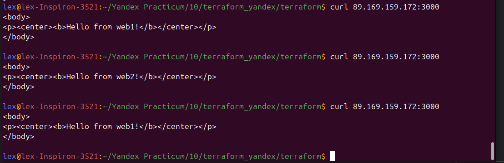

# terraform_yandex_cloud_example

# Описание программы
Terraform разворачивает в Yandex Cloud 3 ВМ
Первая машина используется как балансировщик нагрузки
Две другие как серверы nginx

Подключение осуществляется по 3000 порту на 1 ВМ. Далее происходим переброс на 80 порт одной из машин. 

# Запуск программы
1. Клонируем репозиторий
```
git clone https://github.com/lex-test/terraform_yandex_cloud_example.git
```

2. Пробрасываем credentianal
```
export YC_TOKEN=$(yc iam create-token)
export YC_CLOUD_ID=$(yc config get cloud-id)
export YC_FOLDER_ID=$(yc config get folder-id) 
```

3. Инициализируем
```
cd terraform_yandex_cloud_example/
terraform init
```

4. Запускаем
```
terraform apply
```

5. Тестируем

